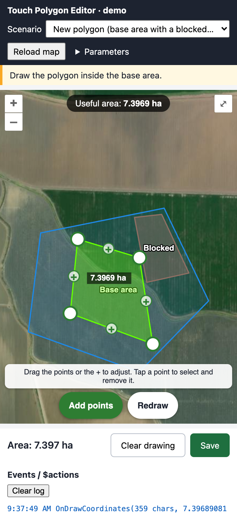

# OpenLayers Touch Polygon Editor

A polygon drawing and editing experience for [OpenLayers](https://openlayers.org/) maps that works equally well with a **finger, a pen or a mouse**. It was built as the map component of an OutSystems application, and it computes the **useful area** of the drawing live: clipped to an allowed area, with blocked areas subtracted.

<p align="center"></p>

## Features

- **Touch first.** With one finger you place and drag points and the map stays still. Two fingers pan and zoom the map. No more map "dancing" while you draw.
- **Edit while drawing.** Drag any vertex, or tap or drag the **"+"** in the middle of an edge to insert a point. There is no separate "edit mode" to enter first.
- **Live useful area.** Using [JSTS](https://github.com/bjornharrtell/jsts), the drawing is intersected with the allowed area and the blocked areas are subtracted. The result is shown in hectares on the map and sent to the host on every change.
- **Live validation.** The editor warns about self-intersecting edges, drawings that split into several separate areas, and drawings outside the allowed area.
- **Edit existing polygons.** A saved polygon opens straight into editing.
- **Mouse and keyboard on desktop:** click to add points, drag an empty area to pan, `Enter` finishes, `Backspace` undoes and `Esc` clears.
- **Pointer-aware hit targets:** about 52 px on touch and 20 px with a mouse.
- **Self-contained.** Styles are injected by the script, so no theme CSS is required. All UI texts can be translated with a single parameter.

## Try it

**Live demo: <https://polygon-editor.hfps.dev>** (best on a phone or tablet).

A static demo lives in [`demo/`](demo/). It runs the component with sample data and logs every event it sends.

```bash
python3 -m http.server 8765        # from the repository root
# open http://localhost:8765/demo/
```

Any static server works (`npx serve .`, for example). Opening the file directly does not work, because the demo loads the component with `fetch`. To test on a phone, bind to `0.0.0.0` and open `http://<your-computer-ip>:8765/demo/`.

URL parameter: `?s=prefill|new|occupied|edit` picks the scenario.

### Deploying the demo

The demo is deployed as a Cloudflare Worker with static assets (see [`wrangler.jsonc`](wrangler.jsonc)). `npm run build` puts only what the browser needs (`demo/`, `src/` and a `/ → /demo/` redirect) in `dist/`, and `npm run deploy` builds and runs `wrangler deploy`.

```bash
npm install
npm run deploy
```

## How it is packaged

The component is written as the body of an **OutSystems JavaScript node**. It reads its inputs from `$parameters` and reports back through `$actions`.

| File | Role |
|---|---|
| [`src/init_map.js`](src/init_map.js) | Creates the map: base layer, optional authenticated WMS, polygons, marker clusters, tooltips and the drawing editor (when `EnableDrawPolygon` is on) |
| [`src/reset_environment.js`](src/reset_environment.js) | Destroys a previous map instance before re-initialising (receives `$parameters.MapDiv`) |

To use it outside OutSystems, run the file with your own `$parameters` / `$actions`, exactly like [`demo/harness.js`](demo/harness.js) does:

```js
new Function('$parameters', '$actions', code)(parameters, actions);
```

Requirements: `ol` **10.6.0** and `jsts` **2.7.1**, loaded as globals (see [`demo/index.html`](demo/index.html)).

## Inputs (`$parameters`)

| Name | Description |
|---|---|
| `MapContainerId`, `TooltipContainerId`, `GUID` | DOM ids of the map and tooltip containers; a unique suffix for helper elements |
| `CenterLongitude`, `CenterLatitude`, `Zoom` | Initial view |
| `ArcGIS_Url`, `ArcGIS_Attributions` | XYZ base layer |
| `WMSUrl`, `Layer`, `Authorization` | Optional WMS overlay, requested with an `Authorization` header |
| `MultiPolygons` | JSON: `{ "polygons": [Polygon] }` (the legacy key `parcelas` is also accepted) |
| `Markers`, `ClusterText` | JSON array of markers (clustered); label for cluster tooltips |
| `EnableDrawPolygon` | Turns the drawing editor on |
| `EnableAlwaysShowPolygon`, `EnableNotFillPolygons`, `EnableOrderPolygonsByCentroid` | Polygon display options |
| `EnableClickMarker`, `EnableMarkerOutPolygon`, `EnableGoToDetails` | Click and double-click behaviours for markers and polygons |
| `DrawOutOfPolygonAlertMessage`, `DrawTwoPolygonsAlertMessage` | Validation texts |
| `ZoomMapOverlayMessage` | Text of the "CTRL + scroll to zoom" overlay |
| `EditablePolygonId` *(optional)* | `PolygonId` of the polygon to edit. Without it, a heuristic is used (see below) |
| `DrawLabels` *(optional)* | JSON that overrides the editor texts and the number locale (defaults are Portuguese) |

A **Polygon** is `{ PolygonId, PolygonName, Coordinates: [{Lon, Lat}], BorderColor, BackgroundColor, CanDrawInsideIt, IsShowTooltip, TooltipTitle, TooltipIsShowDescription, TooltipDescription, TooltipDetailList }`.

### Which polygon is which

- **Allowed area (base):** the largest polygon with `CanDrawInsideIt = true`.
- **Editable polygon:** `EditablePolygonId`, or another `CanDrawInsideIt = true` polygon contained in the base.
- **Blocked areas:** every polygon with `CanDrawInsideIt = false`. They are subtracted from the useful area.

### Translating the UI

```js
DrawLabels: JSON.stringify({
  locale: 'en-US', usefulArea: 'Useful area', undo: 'Undo', clear: 'Clear', finish: 'Finish',
  resume: 'Add points', removePoint: 'Remove point', redraw: 'Redraw', /* … */
})
```

See the `LABELS` object in `src/init_map.js` for the full list of keys, and `demo/harness.js` for a complete English set.

## Events (`$actions`)

| Action | When |
|---|---|
| `OnDrawCoordinates(json, areaHa)` | On every change of the result, from the 3rd point onwards, and never while dragging. `json` is `[{Order, Longitude, Latitude}]` with a closed ring, and `areaHa` is the useful area in hectares. It is `('', -1)` when the drawing is invalid |
| `OnClickSetMarker(lat, lon)` | Map click when `EnableClickMarker` is on |
| `OnClickGoToDetail(id, …flags)` | Double-click on a polygon or marker when `EnableGoToDetails` is on |

The editor also exposes `window.clearDrawPolygon()`, which clears the drawing without firing `OnDrawCoordinates`.

## Tests

[`tests/`](tests/) contains touch-gesture scenarios for Playwright. Each file is an `async (page) => { … }` function that opens a mobile context, sends real touch events through CDP, and returns a JSON report. Run them with Playwright's `browser_run_code` (for example through the Playwright MCP server) while the demo is being served on port 8765.

## Known limitations

- Only one editable polygon per map.
- If a blocked area lies entirely inside the drawing, the useful area has a hole. The area sent accounts for it, but the coordinates sent are only the outer ring.
- On touch, the finger covers the point while it is being placed. A loupe or an offset cursor is a possible improvement.

## Credits

Developed at **[Axians](https://www.axians.com/)**.

- Original OpenLayers map component (base layers, WMS, polygons, clusters, tooltips): the Axians team.
- Touch-first drawing and editing, live useful-area computation, demo and tests: [Henrique Silva](https://github.com/henriquefps).

Built on [OpenLayers](https://openlayers.org/) (BSD-2-Clause) and [JSTS](https://github.com/bjornharrtell/jsts) (EPL-1.0 / EDL-1.0). Demo imagery © Esri.

## License

[MIT](LICENSE) © Axians
