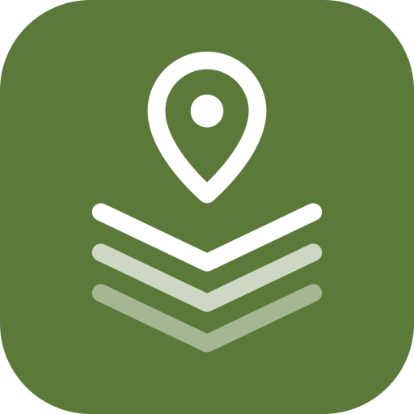
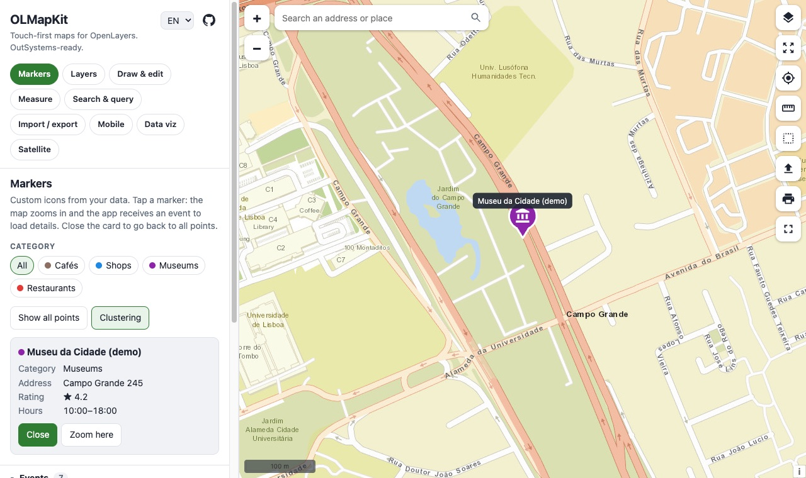
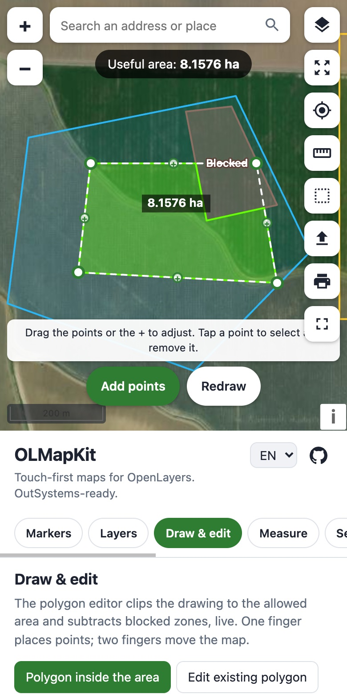
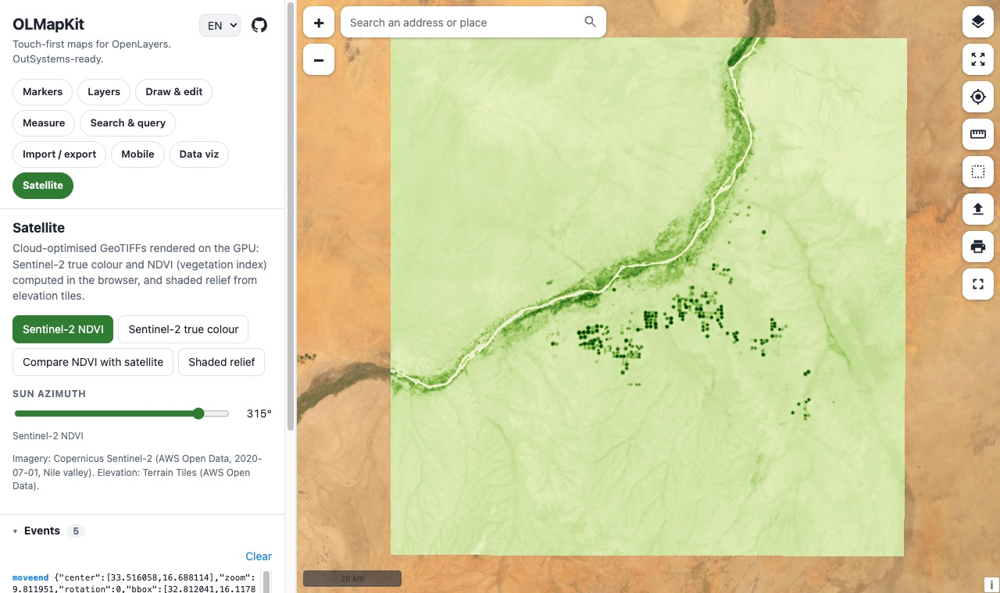
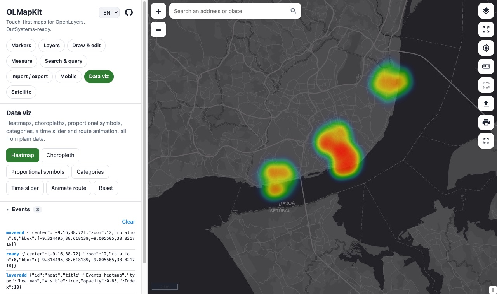

<h1> OLMapKit</h1>

A **touch-first map component for [OpenLayers](https://openlayers.org/)**: markers, layers from any GIS server, polygon drawing and editing, measuring, address search, import/export, printing, GPS tracking, offline maps, data visualisation and satellite imagery. One script, a JSON-in / events-out API, and ready to wrap as an **OutSystems** component.

**Live demo: <https://olmapkit.hfps.dev>**, best on a phone or tablet. It has nine scenarios, English and Portuguese, and an event log.

<p align="center">
  
  
</p>

## Why

The map components usually available in low-code platforms show pins and not much else, and the polished commercial ones charge per map load. OpenLayers is free and does far more, but it takes GIS know-how to use. OLMapKit packages the common needs of business apps into a small API that works with a finger as well as with a mouse.

## Features

| Module | What you get |
|---|---|
| **Markers** | Custom icons per marker or coloured pins, clustering, tap → event + zoom in, close → back to all markers, filters, tooltips |
| **Layers** | WMS (with auth headers, GetFeatureInfo, legends), WMTS, WFS, GeoJSON, KML, GPX, XYZ, vector tiles, georeferenced images. Layers panel with visibility, opacity, order and legend |
| **Base maps** | Streets, satellite, topographic, light, dark (no API key), OpenStreetMap, OpenTopoMap, or your own. Swipe comparison between any two |
| **Draw & edit** | Touch polygon editor: one finger places or drags points while the map stays still; "+" handles insert points; live **useful area** clipped to an allowed area minus blocked zones; snapping; a loupe under the finger; GPS points. Plus lines, points and splitting a polygon with a line |
| **Geometry** | `OLMapKit.geo`: geodesic area and length, buffer in metres, union, intersection, difference, split, validation, simplify |
| **Measure** | Distance, area with perimeter, bearing |
| **Search & query** | Address search (Nominatim, Photon or your own geocoder), reverse geocoding, "what is here?" on WMS, selection by rectangle or polygon |
| **Import / export / print** | Drag and drop GeoJSON, KML/KMZ, GPX, WKT, CSV or zipped shapefiles; export to GeoJSON, KML, GPX, WKT, CSV; print to PNG or PDF with title, scale, north arrow and legend |
| **Mobile** | Blue dot with accuracy and heading, follow mode, GPS track recording, offline base map tiles (IndexedDB) |
| **Data viz** | Heatmaps, choropleths, proportional symbols, categories, time slider, route animation |
| **Satellite** | Cloud-optimised GeoTIFFs on the GPU: true colour and **NDVI computed in the browser** from Sentinel-2 bands; shaded relief from elevation tiles |

<p align="center">
  
  
</p>

## Quick start

```html
<link rel="stylesheet" href="https://cdn.jsdelivr.net/npm/ol@10.6.0/ol.css">
<script src="https://cdn.jsdelivr.net/npm/ol@10.6.0/dist/ol.js"></script>
<script src="https://cdn.jsdelivr.net/npm/jsts@2.7.1/dist/jsts.min.js"></script>
<script src="dist/olmapkit.min.js"></script>

<div id="map" style="height: 500px"></div>
<script>
  const map = OLMapKit.create('map', {
    center: [-9.14, 38.71], zoom: 13, locale: 'en',
    controls: { search: true, measure: true, locate: true, print: true }
  });

  map.markers.set([
    { id: 'a1', lon: -9.1365, lat: 38.7076, title: 'Store A', icon: 'img/store.svg', data: { phone: '…' } }
  ]);
  map.on('markerclick', e => showDetails(e.id));   // the map has zoomed in on the marker
  closeButton.onclick = () => map.markers.clearSelection({ fit: true }); // back to all markers

  map.layers.add({ id: 'zones', type: 'geojson', url: 'zones.geojson', style: { label: 'name' }, popup: true });

  map.draw.polygon({ within: 'zones', snap: true });
  map.on('drawchange', r => console.log(r.status, r.areaHa, r.coordinates));
</script>
```

Optional libraries, needed only for some features: `proj4` (other projections, rasters), `geotiff.js` 2.1.3 (COG rasters), `shpjs` (shapefiles), `jszip` (KMZ), `jspdf` (PDF). See [`demo/index.html`](demo/index.html).

## Documentation

- [API reference](docs/API.md): every option, method and event
- [Using it in OutSystems](docs/outsystems.md): script resources, a block, client actions and events, the Forge component plan, and migrating from the original block
- [Demo source](demo/app.js): each scenario is a few lines of API calls

## OutSystems

The library was born as the map block of an OutSystems application, and the API is designed to become a Forge component: every client action is one API call, and every event comes out as `OnEvent(Name, PayloadJson)` or a typed event. The original `Init_Map` JavaScript node is kept, unchanged, in [`legacy/`](legacy), together with its sandbox.

## Development

```bash
npm install
npm run build     # dist/olmapkit.js and dist/olmapkit.min.js
npm test          # unit tests of the geometry operations
npm run serve     # http://localhost:8765/demo/
```

Browser tests in [`tests/`](tests) (touch gestures on the editor and an end-to-end pass over every module) are Playwright scripts. Each is an `async (page) => { … }` function that returns a JSON report; run it with `browser_run_code`, for example through the Playwright MCP server, while the demo is served.

Source layout: `src/core` (map, events, UI, styles, i18n), `src/modules` (one file per feature), `src/geo` (geometry operations).

## Data and services used by the demo

Sample data is fictitious. Base maps © Esri and © OpenStreetMap contributors. WMS/WFS: GeoSolutions demo GeoServer. Imagery: Copernicus Sentinel-2 (AWS Open Data). Elevation: Terrain Tiles (AWS Open Data). Geocoding: Nominatim © OpenStreetMap. Check each provider's terms before using them in production (see [notes](docs/outsystems.md#4-notes-for-production)).

## Credits

Created by **[Henrique Silva](https://github.com/henriquefps)**, Solutions Specialist at **Axians Low Code**.

- Original OpenLayers map component for OutSystems: the Axians team.
- OLMapKit, the touch-first editor, demo and tests: [Henrique Silva](https://github.com/henriquefps).

Built on [OpenLayers](https://openlayers.org/) (BSD-2-Clause) and [JSTS](https://github.com/bjornharrtell/jsts) (EPL-1.0 / EDL-1.0).

## License

[MIT](LICENSE) © Axians
